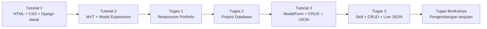
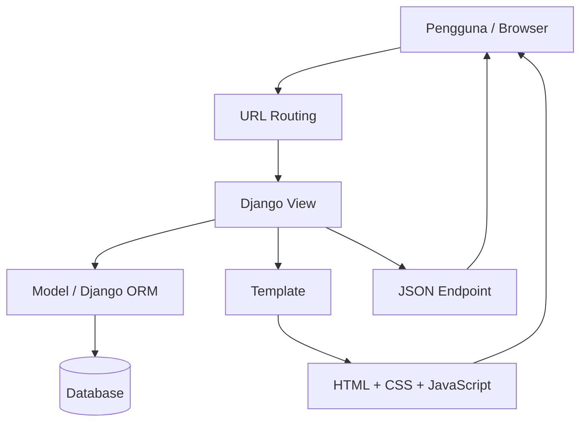
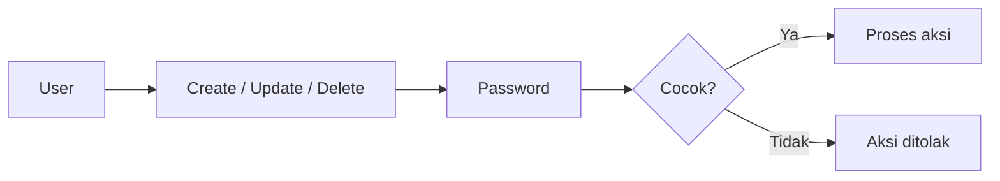

# My Portofolio

Selamat datang di repositori portofolio pribadi saya!

Repositori ini digunakan untuk mengerjakan seluruh rangkaian tugas dan tutorial mata kuliah **Pemrograman Berbasis Platform (PBP), Gasal 2026/2027** ^-^

<p align="center">
  
  
  
  
  
  
</p>

[Identitas](#identitas-diri) · [Tentang Proyek](#tentang-proyek) · [Perkembangan](#perkembangan-proyek) · [Menjalankan Proyek](#menjalankan-proyek) · [Refleksi Mingguan](#refleksi-mingguan) · [Penggunaan AI](#penggunaan-ai)

---

## Identitas Diri

| Keterangan | Identitas |
| --- | --- |
| Nama | Salwa Alifia Putri |
| NPM | 2506620280 |
| Kelas | PBP A |
| Program Studi | S1 Sistem Informasi |
| Institusi | Universitas Indonesia |

---

## Tentang Proyek

Website ini merupakan portofolio pribadi yang menampilkan profil, pengalaman, proyek, dan keahlian saya dalam satu aplikasi web.

Proyek ini dikerjakan secara **bertahap sepanjang semester** dengan melanjutkan hasil dari tutorial dan tugas sebelumnya. Karena itu, README ini juga diperlakukan sebagai dokumentasi yang terus berkembang: setiap tugas baru akan menambahkan fitur, refleksi, catatan implementasi, serta pembaruan setup tanpa menghilangkan riwayat perkembangan sebelumnya.

Pada tahap awal, portofolio masih bersifat statis. Seiring bertambahnya materi Django, project berkembang menjadi aplikasi yang menggunakan **Model-View-Template (MVT)**, database, form, CRUD, JSON API, dan fitur interaktif.

### Arah Perkembangan Proyek

```text
Static Portfolio
      ↓
Django MVT
      ↓
Database-backed Content
      ↓
Dynamic Projects & Skills
      ↓
ModelForm + CRUD
      ↓
JSON Delivery
      ↓
Interactive Frontend
      ↓
Fitur tambahan & pengembangan berikutnya
```

### Teknologi dan Fungsinya

| Teknologi | Penggunaan dalam proyek |
| --- | --- |
| **HTML5** | Struktur konten dan elemen semantik halaman |
| **CSS3** | Warna, tipografi, Grid, Flexbox, media query, dan efek hover |
| **JavaScript** | Interaksi frontend dan pengambilan data JSON |
| **Python** | Bahasa pemrograman backend |
| **Django** | Routing, view, model, ORM, form, template, dan logika aplikasi |
| **Git** | Mencatat perubahan kode dan membantu pengembangan bertahap |
| **GitHub** | Menyimpan repositori dan dokumentasi proyek |
| **Google Gemini API** | Mendukung fitur AI Chat Widget melalui backend |

---

## Perkembangan Proyek

Bagian ini akan terus diperbarui sampai akhir rangkaian tugas.

| Tahap | Lingkup Pengembangan |
| --- | --- |
| **Tutorial 1** | Halaman About Me serta penghubungan view, URL, template, dan static files sesuai tutorial. |
| **Tutorial 2** | Implementasi konsep MVT Django melalui model `Experience`, migration database, queryset pada view, template dinamis, routing URL, base template, serta unit testing. |
| **Tugas 1** | Penambahan Experience, Featured Projects, dan Skills; pengembangan styling kartu; serta perbaikan layout mobile agar elemen tidak bertumpuk dan konten lebih mudah dibaca. |
| **Tugas 2** | Pengembangan Featured Projects berbasis database menggunakan model `Project`, migration, fixture, queryset, halaman Projects terpisah, navigasi, template dinamis dengan empty state, serta pengujian fitur. |
| **Tutorial 3** | Pembuatan skeleton `base.html` sebagai root template, penerapan `ModelForm` untuk `Project`, serta implementasi create, update, delete, dan JSON delivery untuk `Project`. |
| **Tugas 3** | Refactor template agar extend dari `base.html`; pembuatan model `Skill` menggantikan data Skills yang sebelumnya hardcoded; `ModelForm`, create, update, delete, JSON delivery, dan penampilan data hasil deserialisasi JSON secara langsung pada halaman kelola Skills. |
| **Tugas berikutnya** | Akan ditambahkan pada bagian ini beserta perubahan fitur, konsep yang dipelajari, dan catatan implementasinya. |

### Timeline Implementasi



---

## Berkas Utama

Struktur berkas akan berkembang seiring bertambahnya fitur, tetapi tanggung jawab utamanya tetap dipisahkan agar mudah dipahami.

| Lokasi | Fungsi |
| --- | --- |
| `manage.py` | Menjalankan perintah pengelolaan proyek Django |
| `portofolio/settings.py` | Konfigurasi proyek, template, static files, dan pengaturan lainnya |
| `portofolio/urls.py` | Pemetaan URL utama proyek |
| `main/models.py` | Definisi model dan struktur data |
| `main/views.py` | Logika request dan response |
| `main/forms.py` | Definisi `ModelForm` |
| `main/tests.py` | Pengujian fitur |
| `templates/` | HTML template |
| `static/` | CSS, gambar, dan aset statis |
| `requirements.txt` | Dependensi Python |
| `README.md` | Dokumentasi proyek, progres, refleksi, dan penggunaan AI |

---

## Arsitektur Aplikasi

Proyek menggunakan pola **Model-View-Template (MVT)** Django.



Secara sederhana, terdapat dua jalur utama:

### Server-rendered page

```text
Browser
   ↓
urls.py
   ↓
View
   ↓
Model / ORM
   ↓
Database
   ↓
Template
   ↓
HTML Response
   ↓
Browser
```

### JSON delivery

```text
Browser
   ↓
GET /api/skills/
   ↓
Django View
   ↓
Django ORM
   ↓
QuerySet
   ↓
Serialization
   ↓
JSON Response
   ↓
JavaScript
   ↓
DOM
```

---

# Menjalankan Proyek

## 1. Clone Repository

Clone repository dari GitHub, kemudian buka terminal pada folder yang berisi `manage.py`.

```bash
git clone <repository-url>
cd <project-folder>
```

## 2. Siapkan Virtual Environment

Jika folder `env` belum tersedia:

```bash
python -m venv env
```

## 3. Aktifkan Virtual Environment

### Windows PowerShell

```powershell
.\env\Scripts\Activate.ps1
```

### Windows Command Prompt

```bat
env\Scripts\activate.bat
```

### macOS / Linux

```bash
source env/bin/activate
```

## 4. Pasang Dependensi

```bash
python -m pip install -r requirements.txt
```

## 5. Siapkan Environment Variable

Konfigurasi lokal mengikuti kebutuhan project dan `settings.py`.

Contoh nilai sensitif yang **tidak boleh ditulis langsung ke source code**:

```text
DJANGO_SECRET_KEY=...
GEMINI_API_KEY=...
PORTFOLIO_EDIT_PASSWORD=...
```

Gunakan environment variable lokal atau mekanisme secret yang disediakan platform deployment.

> Jangan commit file `.env`, API key, password, atau secret key ke repository publik.

## 6. Jalankan Pemeriksaan Django

```bash
python manage.py check
```

## 7. Terapkan Migration

Jika project menggunakan database yang membutuhkan migration:

```bash
python manage.py migrate
```

## 8. Jalankan Development Server

```bash
python manage.py runserver
```

Kemudian buka:

```text
http://localhost:8000/
```

Pastikan CSS, gambar, template, dan fitur yang memerlukan backend berjalan melalui server Django, bukan dengan membuka file HTML langsung dari file manager.

### Setup Mingguan

Karena repository ini akan terus dikembangkan, setup awal tidak perlu diulang setiap minggu selama virtual environment dan dependensi masih tersedia.

Untuk perubahan fitur, alur yang disarankan:

```text
Tarik perubahan terbaru
        ↓
Aktifkan virtual environment
        ↓
Install dependency baru (jika ada)
        ↓
python manage.py check
        ↓
python manage.py migrate (jika ada perubahan model)
        ↓
python manage.py test
        ↓
python manage.py runserver
```

# Refleksi Mingguan

### Tugas 1

1. **Penggunaan elemen semantik HTML5**

   Saya menggunakan elemen semantik HTML5 untuk membagi halaman berdasarkan fungsi kontennya. Elemen `<header>` memuat identitas dan navigasi, `<nav>` mengelompokkan tautan menuju bagian halaman, dan `<main>` menandai konten utama. Bagian Profile, Experience, Featured Projects, dan Skills menggunakan `<section>` karena masing-masing mempunyai tema yang jelas. Setiap bagian juga memiliki heading agar hierarki informasi lebih mudah diikuti.

   Untuk setiap item pengalaman, proyek, dan kelompok keahlian, saya menggunakan `<article>`. Setiap kartu memuat judul dan penjelasan yang tetap dapat dipahami sebagai satu unit informasi. Sementara itu, `<footer>` digunakan untuk informasi penutup. Saya tidak menggunakan `<aside>` karena belum ada konten tambahan yang bersifat pelengkap di luar alur utama portofolio. Elemen `<div>` tetap digunakan untuk pengelompokan layout, seperti container dan grid, yang tidak selalu membutuhkan makna semantik tersendiri.

   Pembagian tersebut membantu saya membaca dan mengembangkan kode tanpa harus menafsirkan fungsi setiap `<div>` dari nama class saja. Struktur yang jelas juga membantu teknologi bantu mengenali bagian navigasi dan konten utama. Namun, elemen semantik tidak otomatis membuat tampilan menjadi rapi atau seluruh halaman menjadi aksesibel. CSS, urutan heading, teks alternatif foto, dan indikator fokus tautan tetap diperlukan. Karena itu, struktur HTML digunakan untuk menjelaskan makna konten, sedangkan CSS digunakan untuk mengatur tampilannya.

2. **Tantangan dan pertimbangan dalam membuat layout responsif**

   Tantangan utama pada kode awal adalah layout profil yang tetap menggunakan dua kolom dan kartu yang tetap menggunakan tiga kolom tanpa media query. Susunan tersebut memberi ruang untuk membaca di desktop, tetapi dapat membuat teks terlalu sempit ketika layar mengecil. Navigasi, pasangan NPM dan program studi, serta dekorasi foto yang bergeser dari batas gambar juga perlu diperhatikan agar tidak menimbulkan elemen yang melebar keluar layar.

   Pada versi revisi, kartu menggunakan tiga kolom di desktop, dua kolom pada lebar layar maksimal 900px, dan satu kolom pada lebar maksimal 600px. Untuk profil di mobile, urutannya menjadi nama, foto, kemudian bio dan informasi kontak. Nama diprioritaskan agar identitas langsung terlihat, sedangkan foto dibatasi ukurannya supaya tidak mendominasi layar. Urutan ini juga mengikuti urutan elemen dalam HTML. Navigasi dan metadata diberi kemampuan membungkus baris, sementara `minmax(0, ...)`, `min-width: 0`, dan `overflow-wrap` membantu mengendalikan konten di dalam grid.

   Dasar evaluasi saya adalah keterbacaan dan prioritas informasi, bukan sekadar mengecilkan semua ukuran secara proporsional. Teks utama perlu tetap nyaman dibaca, tautan perlu mudah dipilih, dan pengguna tidak seharusnya harus menggulir horizontal untuk membaca kartu. Breakpoint tersebut merupakan keputusan desain yang perlu dibuktikan melalui pemeriksaan browser, bukan jaminan bahwa semua ukuran layar sudah sesuai. Evaluasi visual perlu dilakukan pada lebar seperti 375px, 768px, dan 1440px, serta saat teks diperbesar. Pada saat draf dokumentasi ini disusun, pemeriksaan yang tersedia baru mencakup struktur kode; hasil pengujian browser belum dicatat.

3. **Batasan static web dan rencana pengembangan dinamis**

   Batasan utama pada struktur saat ini adalah semua informasi portofolio ditulis langsung dalam HTML. Ketika ada pengalaman, proyek, atau keahlian baru, saya perlu mengubah markup secara manual. Pendekatan ini masih cukup untuk konten yang sedikit, tetapi pengelolaannya menjadi kurang praktis ketika jumlah item bertambah. Pengulangan struktur kartu juga berpotensi menimbulkan ketidakkonsistenan apabila setiap perubahan dilakukan satu per satu.

   Prioritas pengembangan berikutnya adalah pengelolaan data proyek melalui model Django dan antarmuka admin. Data seperti judul, deskripsi, kategori, dan tautan proyek dapat disimpan sebagai field, kemudian diambil oleh view dan ditampilkan melalui perulangan pada template. Dengan demikian, perubahan isi tidak selalu membutuhkan perubahan struktur HTML. CSS kartu yang sudah digunakan kembali pada Tugas 1 dapat dipertahankan ketika sumber datanya menjadi dinamis.

   Fitur tersebut saya prioritaskan karena langsung menjawab kebutuhan pemeliharaan portofolio. Pengembangannya juga memerlukan validasi data, pembatasan akses pengelola, dan penanganan kondisi ketika belum ada proyek. Static web sendiri tetap dapat memiliki interaksi berbasis CSS, seperti hover dan navigasi anchor. Keterbatasan yang saya maksud terutama terletak pada pengelolaan data dan pemrosesan di server. Pada Tugas 2, rencana tersebut sudah diimplementasikan. Data project kini disimpan dalam model Django, diambil melalui view, ditampilkan secara dinamis pada template Projects, dan dapat dikelola melalui database atau Django Admin.

### Tugas 2

1. **Alur yang terjadi ketika pengguna membuka halaman portofolio baru**

   Ketika pengguna membuka halaman portofolio baru, browser mengirimkan HTTP request ke alamat website. Request tersebut pertama kali diterima oleh proyek Django melalui `urls.py` utama yang berada di folder konfigurasi proyek. Berkas ini berfungsi sebagai pintu masuk routing dan menentukan aplikasi mana yang menangani URL tersebut.

   Selanjutnya, `urls.py` proyek meneruskan request ke `urls.py` milik aplikasi `main`. Pada berkas ini, URL seperti `/projects/` dihubungkan dengan fungsi view menggunakan nama rute `show_projects`.

   View `show_projects` kemudian menjalankan logika aplikasi. View mengambil data project dari database melalui model `Project` menggunakan Django ORM, misalnya dengan perintah `Project.objects.all()`. Hasil query tersebut disimpan dalam sebuah queryset dan dikirimkan ke template melalui context dengan nama `project_list`.

   Template `projects.html` menerima context tersebut dan menampilkan data menggunakan perulangan Django Template Language. Setiap object project ditampilkan sebagai sebuah kartu yang berisi nama project, kategori, dan deskripsinya. Jika database belum memiliki data project, template menampilkan pesan empty state yang memberi tahu pengguna bahwa belum ada project yang tersedia.

   Setelah template selesai diproses, Django menggabungkan struktur HTML dengan data dari database. Django kemudian mengirimkan HTML tersebut sebagai HTTP response ke browser. Browser membaca HTML dan CSS, lalu menampilkan halaman Projects yang dapat dilihat oleh pengguna.

   Secara keseluruhan, alurnya adalah:

   `Browser → urls.py proyek → urls.py aplikasi → view → model/database → template → HTTP response → browser`

   Pada alur ini, `urls.py` mengatur tujuan request, view mengatur logika pengambilan data, model menjadi penghubung dengan database, dan template mengatur tampilan akhir halaman ^^

2. **Mengapa data untuk bagian portofolio baru sebaiknya disimpan pada model dan tidak ditulis langsung di dalam template**

   Data portofolio sebaiknya disimpan pada model karena data tersebut merupakan isi aplikasi, bukan bagian dari struktur tampilan. Template seharusnya hanya mengatur bagaimana data ditampilkan. Dengan pemisahan ini, kode menjadi lebih teratur dan mengikuti konsep Model-View-Template pada Django.

   Jika data project ditulis langsung di dalam template, setiap perubahan kecil seperti mengganti nama project, memperbarui deskripsi, atau menambahkan project baru mengharuskan developer mengubah kode HTML. Cara ini tidak efisien dan dapat meningkatkan risiko kesalahan, terutama ketika jumlah data semakin banyak.

   Dengan menggunakan model, data project tersimpan di database dan dapat dikelola secara terpisah dari template. Data dapat ditambahkan, diubah, atau dihapus melalui Django Admin atau database tanpa mengubah struktur HTML. Template cukup menggunakan perulangan untuk menampilkan semua data yang tersedia.

   Penyimpanan melalui model juga membuat aplikasi lebih mudah dikembangkan. Misalnya, model `Project` dapat ditambahkan field baru seperti tahun project, teknologi yang digunakan, gambar, tautan repository, atau status project. View dan template kemudian dapat dikembangkan untuk menampilkan informasi tersebut tanpa menulis kartu HTML satu per satuuu

   Pendekatan ini juga mendukung penggunaan ulang data. Data project yang sama dapat ditampilkan pada halaman Projects, halaman Profile, dashboard admin, atau endpoint API. Jika data ditulis langsung di template, penggunaan ulang seperti ini akan lebih sulit.

   Dari sisi pemeliharaan, model membuat perubahan data lebih aman, terpusat, dan konsisten. Template menjadi lebih bersih karena hanya berisi struktur tampilan. Pemisahan antara data, logika, dan tampilan juga membuat proses pengujian lebih mudah. Developer dapat menguji model, view, dan template secara terpisah.

   Jadi, model membantu aplikasi menjadi lebih fleksibel, mudah dirawat, mudah dikembangkan, dan mampu menangani data yang terus bertambah :D

3. **Apa perbedaan fungsi `makemigrations` dan `migrate` pada Django?**

   `makemigrations` digunakan untuk membuat file migration berdasarkan perubahan yang dilakukan pada model. Perintah ini hanya mencatat perubahan struktur database dalam bentuk instruksi yang dapat dijalankan Django. Perintah ini belum mengubah database secara langsung. Sementara itu, `migrate` digunakan untuk menjalankan file migration ke database. Perintah ini benar-benar membuat, mengubah, atau menghapus tabel dan kolom sesuai instruksi yang ada di file migration

   Contohnya, ketika saya menambahkan model `Project` pada `main/models.py`, saya menjalankan `python manage.py makemigrations` untuk membuat berkas migration yang mencatat struktur model baru. Setelah itu, saya menjalankan `python manage.py migrate` untuk menerapkan migration tersebut sehingga tabel Project tersedia di database

   Kedua perintah tersebut juga diperlukan ketika menambahkan field baru, misalnya field `github_url` bertipe `URLField` pada model `Project`. Ini hanya contoh perubahan struktur model. Menambahkan atau mengubah isi data project melalui Django Admin tidak memerlukan migration karena struktur tabelnya tetap samaaa


### Tugas 3

1. **Mengapa menggunakan `ModelForm` dan mengapa perlu ``?**

   Saya menggunakan `ModelForm` daripada membuat form HTML manual karena field form dapat mengikuti definisi model yang sudah dibuat

   Dengan pendekatan ini, Django dapat membantu membuat field dan validasi berdasarkan tipe field pada model. Misalnya, `URLField` dapat melakukan validasi terkait format URL dan `CharField` mengikuti batas `max_length`

   `ModelForm` juga menyediakan `save()` untuk membuat atau memperbarui instance model. Saya tidak perlu menulis ulang seluruh proses pemetaan data dari `request.POST` ke object model

   Dengan kata lain seperti inii

   ```text
   Model
   ↓
   ModelForm
   ↓
   Validasi
   ↓
   save()
   ↓
   Database
   ```

   Pendekatan ini mengurangi duplikasi aturan data dan membantu menjaga model sebagai sumber utama definisi struktur data

   ### CSRF Protection

   Form yang melakukan perubahan data menggunakan `POST`, misalnya

   ```text
   Create
   Update
   Delete
   ```

   Karena itu saya menambahkan

   ```django
   
   ```

   CSRF protection membantu Django memverifikasi bahwa request perubahan data berasal dari form yang sesuai dengan aplikasi, sehingga aplikasi memiliki perlindungan terhadap pola serangan **Cross-Site Request Forgery**

   ```mermaid
   sequenceDiagram
      participant U as User
      participant B as Browser
      participant D as Django

      U->>B: Submit form
      B->>D: POST + CSRF token
      D->>D: Verifikasi token

      alt Token valid
         D->>D: Proses perubahan data
         D-->>B: Response berhasil
      else Token tidak valid
         D-->>B: Request ditolak
      end
   ```
2. **Mengapa JSON digunakan dibandingkan XML?**

   Dalam project ini, JSON lebih praktis untuk komunikasi antara backend Django dan JavaScript karena strukturnya menggunakan object dan array yang mudah diproses oleh JavaScript

   Contoh:

   ```json
   {
   "name": "Python",
   "level": "Advanced"
   }
   ```

   Di sisi frontend, response dapat diproses dengan

   ```javascript
   fetch("/api/skills/")
   .then(response => response.json())
   .then(data => {
         // data digunakan untuk render ke halaman
   });
   ```

   JSON juga memiliki sintaks yang lebih ringkas dibandingkan XML untuk struktur data sederhana.

   Contoh XML

   ```xml
   <skill>
      <name>Python</name>
      <level>Advanced</level>
   </skill>
   ```

   Perbedaannya bukan berarti XML tidak digunakan lagi. XML tetap relevan pada sistem tertentu yang membutuhkan karakteristik seperti namespace dan schema, tetapi untuk kebutuhan frontend-backend sederhana pada project ini, JSON lebih praktis

3. **Mengapa perlu serialization pada model Django?**

   Ketika view mengambil

   ```python
   Skill.objects.all()
   ```

   hasilnya adalah `QuerySet` yang berisi object model Django

   Object tersebut tidak dapat langsung dikirim sebagai JSON karena JSON tidak memahami object Python/Django beserta method dan state internalnya

   Karena itu, diperlukan proses **serialization** untuk mengubah data model menjadi struktur yang dapat direpresentasikan dalam JSON

   ```mermaid
   flowchart LR
      A[(Database)]
      B[Django ORM]
      C[QuerySet]
      D[Serializer]
      E[JSON Response]
      F[JavaScript]
      G[DOM]

      A --> B --> C --> D --> E --> F --> G
   ```

   Contoh sederhana pada backend

   ```python
   from django.core.serializers import serialize

   data = serialize("json", Skill.objects.all())
   ```

   Kemudian data tersebut dikembalikan sebagai response

   ```python
   HttpResponse(
      data,
      content_type="application/json"
   )
   ```

   Di sisi client, JavaScript menerima response tersebut dan melakukan deserialisasi melalui

   ```javascript
   response.json()
   ```

   Sehingga alur lengkapnya adalah

   ```text
   Database
      ↓
   Django ORM
      ↓
   Model / QuerySet
      ↓
   Serialization
      ↓
   JSON
      ↓
   Deserialization
      ↓
   JavaScript Object
      ↓
   DOM
   ```

---

## Fitur Tambahan

Selain requirement utama, saya menambahkan beberapa fitur tambahan sebagai bagian dari eksplorasi pengembangan project.

### AI Chat Widget

Widget chat dapat diakses dari halaman portofolio dan digunakan untuk bertanya mengenai pengalaman, skill, dan project yang ditampilkan.

Request tidak langsung dikirim dari browser ke Gemini API. Request terlebih dahulu masuk ke endpoint backend Django:

```text
Browser
   ↓
Chat Widget
   ↓
/api/chat/
   ↓
Gemini API
   ↓
Django
   ↓
Chat Widget
```

API key disimpan melalui environment variable dan tidak ditulis langsung pada kode frontend :D

### Proteksi Data Sederhana

Untuk operasi create, update, dan delete pada Skill serta Project, project menggunakan password validation sederhana.

Alurnya:



Mekanisme ini **bukan sistem authentication penuh** karena belum menggunakan account, session, atau permission system. Implementasi ini digunakan sebagai lapisan proteksi sederhana sesuai ruang lingkup materi yang sudah dipelajari

---

# Penggunaan AI

## AI Disclosure

Saya menggunakan AI sebagai **pendamping belajar, debugging assistant, dan alat untuk membantu mengeksplorasi alternatif solusi**.

AI tidak digunakan sebagai pengganti proses implementasi dan verifikasi. Setiap saran perlu saya pahami, sesuaikan dengan struktur project, kemudian diuji kembali melalui kode dan browser.

### Tools yang Digunakan

| Tools | Peran dalam proses |
| --- | --- |
| **ChatGPT** | Membantu memahami HTML/CSS, debugging frontend, responsive layout, dan penyusunan dokumentasi/refleksi |
| **Claude** | Membantu memahami konsep Task 3 seperti `ModelForm`, serializer Django, JSON, CSRF, environment variable, membuat diagram dalam README.md, serta debugging backend/deployment |

---

## Strategi Prompting

Saya tidak hanya menggunakan satu prompt besar untuk seluruh pengerjaan. Saya menggunakan pendekatan bertahap agar masalah dapat dipahami dan diuji satu per satu.

```text
1. Berikan konteks project
        ↓
2. Jelaskan tujuan / requirement tugas
        ↓
3. Tunjukkan bagian kode atau error yang relevan
        ↓
4. Minta penjelasan penyebab, bukan hanya jawaban
        ↓
5. Minta beberapa kemungkinan solusi bila perlu
        ↓
6. Implementasikan dan uji secara manual
        ↓
7. Kembali ke AI bila hasil belum sesuai
        ↓
8. Rapikan solusi final + dokumentasikan pemahamannya
```


# Evaluasi Kritis terhadap AI

Saya menyadari bahwa jawaban AI tidak otomatis benar hanya karena terlihat masuk akal atau karena kode yang diberikan dapat dijalankan.

Beberapa keterbatasan AI yang saya temukan:

### 1. AI tidak mengetahui konteks project secara sempurna

Saran yang benar pada project Django lain belum tentu cocok dengan struktur folder, nama model, URL, atau cara implementasi pada project saya.

Karena itu, saran AI perlu disesuaikan dengan kode aktual.

### 2. AI dapat memberikan solusi yang terlalu umum

Contohnya, solusi CSS yang secara teori benar belum tentu menghasilkan layout yang sesuai dengan desain ketika dijalankan pada viewport tertentu.

Karena itu, saya tetap menggunakan browser sebagai alat verifikasi

### 3. AI tidak menggantikan testing

Jawaban AI tidak membuktikan bahwa:

- migration berhasil;
- endpoint mengembalikan data yang benar;
- static files termuat;
- layout mobile tidak bertumpuk;
- environment variable berhasil dibaca;
- deployment berjalan sesuai harapan.

Semua hal tersebut tetap perlu diuji secara langsung dan debugging mandiri agar terlatih

### 4. AI dapat menghasilkan lebih dari satu solusi

Beberapa masalah memiliki banyak cara penyelesaian. Saya tidak selalu mengambil solusi pertama yang diberikan. Saya mencoba memahami trade-off-nya, menyesuaikan dengan materi kuliah, lalu memilih pendekatan yang paling sesuai dengan struktur project.

---

# Perbaikan Manual Setelah Menggunakan AI

AI berfungsi sebagai titik awal analisis. Setelah menerima saran, saya melakukan penyesuaian dan verifikasi secara manual.

| Masalah | Bantuan AI | Perbaikan / Verifikasi Manual |
| --- | --- | --- |
| `.section-title` tidak terhubung ke heading | Menjelaskan hubungan selector HTML-CSS | Memeriksa dan memperbaiki class pada HTML |
| Kartu bertumpuk pada mobile | Memberi kemungkinan penyebab dan contoh media query | Menyesuaikan breakpoint dan layout lalu mengecek browser |
| `ModelForm` dan validasi | Menjelaskan konsep | Mencocokkan field form dengan model project |
| Serialization JSON | Menjelaskan alur model → serializer → JSON | Menguji endpoint dan response frontend |
| Duplicate key pada context | Membantu menemukan sumber masalah | Memeriksa context aktual dan memperbaiki struktur dictionary |
| Environment variable | Menjelaskan pola konfigurasi secret | Menyesuaikan dengan konfigurasi lokal/deployment PWS |

---

## Refleksi Penggunaan AI

Penggunaan AI paling membantu ketika saya menggunakannya untuk **memahami alasan di balik suatu solusi**, bukan hanya meminta kode final.

Perbedaan yang saya rasakan adalah:

```text
"Berikan saya kode yang benar"
                ↓
   Mendapatkan solusi
                ↓
       Pemahaman terbatas
```

dibandingkan:

```text
"Jelaskan mengapa masalah ini terjadi
 pada kode saya dan bagaimana cara
 menguji apakah solusinya benar"
                ↓
       Memahami penyebab
                ↓
       Mencoba solusi
                ↓
           Melakukan test
                ↓
        Memahami hasil akhir
```

Karena itu, AI saya gunakan sebagai **learning companion**. Keberhasilan suatu solusi tetap saya ukur dari implementasi dan pengujian pada project yang sebenarnya^^

---

# Catatan Keamanan

Project ini merupakan project pembelajaran dan belum dimaksudkan sebagai aplikasi production

Beberapa prinsip yang sudah diterapkan:

- Form perubahan data menggunakan CSRF protection.
- Secret/API key disimpan melalui environment variable.
- Password untuk proteksi manual tidak ditulis langsung pada source code.
- Mekanisme password manual dijelaskan secara terbuka sebagai **proteksi sederhana**, bukan authentication system.

Untuk aplikasi production, mekanisme authentication dan authorization yang lebih lengkap tetap diperlukan.

---

# Referensi

- [Django — The Development Server](https://docs.djangoproject.com/en/5.2/intro/tutorial01/#the-development-server)
- [Django — Model Forms](https://docs.djangoproject.com/en/5.2/topics/forms/modelforms/)
- [Django — Serialization](https://docs.djangoproject.com/en/5.2/topics/serialization/)
- [Django — CSRF Protection](https://docs.djangoproject.com/en/5.2/ref/csrf/)
- [Shields.io](https://shields.io/badges/static-badge)
