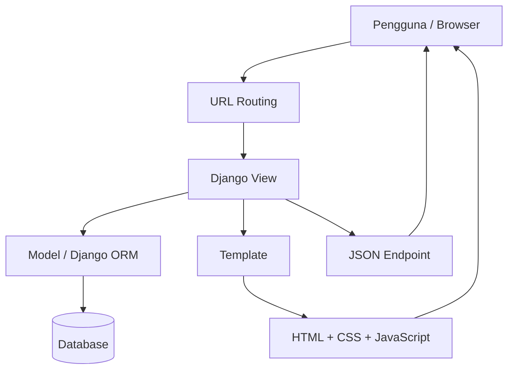
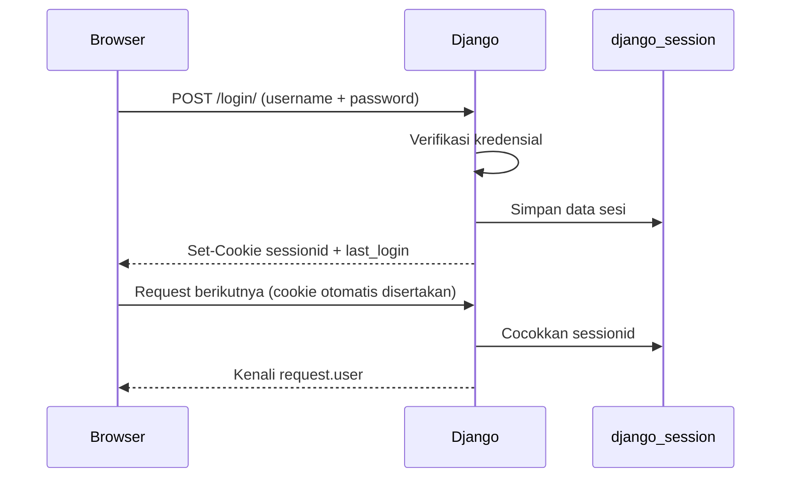
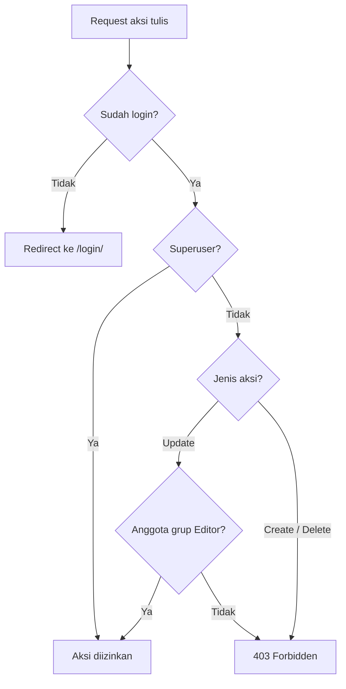
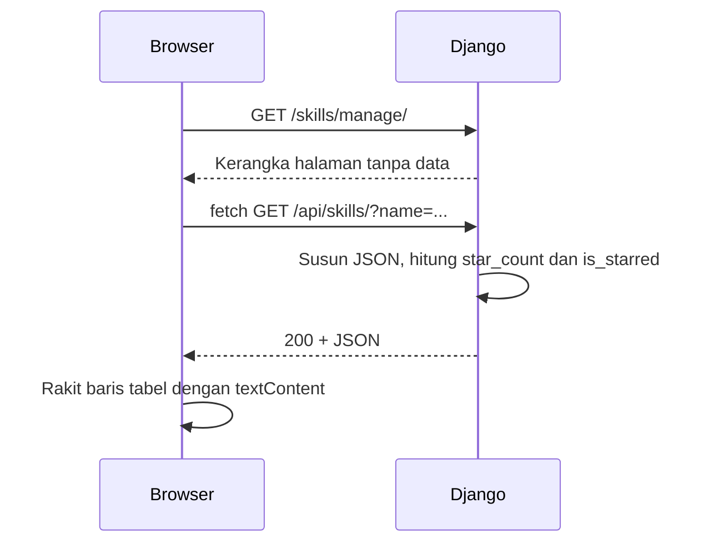
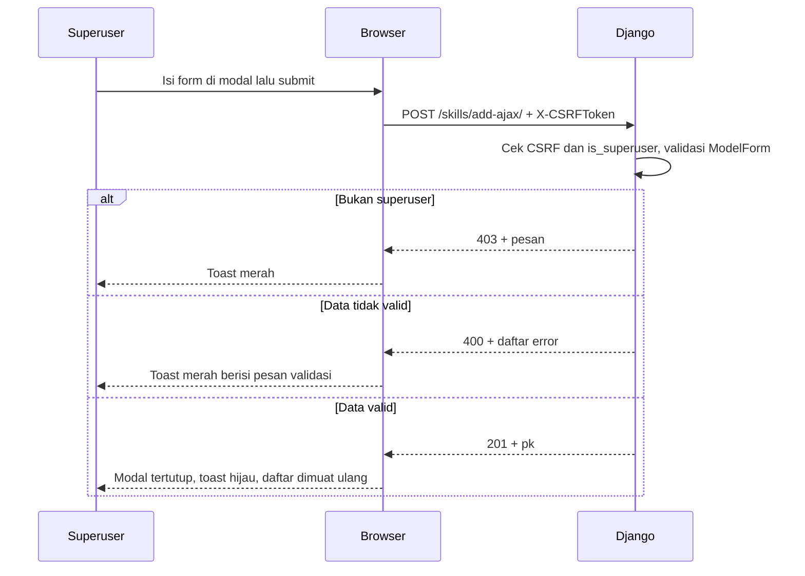

# My Portofolio

Selamat datang di repositori portofolio pribadi saya!

Repositori ini digunakan untuk mengerjakan seluruh rangkaian tugas dan tutorial mata kuliah **Pemrograman Berbasis Platform (PBP), Gasal 2026/2027** ^-^

<p align="center">
  
  
  
  
  
  
  
</p>

[Identitas](#identitas-diri) · [Tentang Proyek](#tentang-proyek) · [Perkembangan](#perkembangan-proyek) · [Menjalankan Proyek](#menjalankan-proyek) · [Refleksi Mingguan](#refleksi-mingguan) · [Penggunaan AI](#penggunaan-ai)

---

## Identitas Diri

| Keterangan | Identitas |
| --- | --- |
| Nama | Salwa Alifia Putri |
| NPM | 2506620280 |
| Kelas | PBP A |
| Program Studi | S1 Sistem Informasi |
| Institusi | Universitas Indonesia |

---

## Tentang Proyek

Website ini merupakan portofolio pribadi yang menampilkan profil, pengalaman, proyek, dan keahlian saya dalam satu aplikasi web.

Proyek ini dikerjakan secara **bertahap sepanjang semester** dengan melanjutkan hasil dari tutorial dan tugas sebelumnya. Karena itu, README ini juga diperlakukan sebagai dokumentasi yang terus berkembang: setiap tugas baru akan menambahkan fitur, refleksi, catatan implementasi, serta pembaruan setup tanpa menghilangkan riwayat perkembangan sebelumnya.

Pada tahap awal, portofolio masih bersifat statis. Seiring bertambahnya materi Django, project berkembang menjadi aplikasi yang menggunakan **Model-View-Template (MVT)**, database, form, CRUD, JSON API, fitur interaktif, **sistem autentikasi dan otorisasi berbasis peran**, serta **AJAX dengan JavaScript** untuk memuat dan menambah data tanpa me-reload halaman.

### Arah Perkembangan Proyek

```text
Static Portfolio
      ↓
Django MVT
      ↓
Database-backed Content
      ↓
Dynamic Projects & Skills
      ↓
ModelForm + CRUD
      ↓
JSON Delivery
      ↓
Interactive Frontend
      ↓
Authentication, Session & Cookie
      ↓
Role-based Authorization
      ↓
AJAX, Toast & Perlindungan XSS
      ↓
Fitur tambahan & pengembangan berikutnya
```

### Teknologi dan Fungsinya

| Teknologi | Penggunaan dalam proyek |
| --- | --- |
| **HTML5** | Struktur konten dan elemen semantik halaman |
| **CSS3** | Warna, tipografi, Grid, Flexbox, media query, dan efek hover |
| **JavaScript** | Interaksi frontend: AJAX dengan Fetch API, debouncing pencarian, modal dengan Popover API, dan notifikasi toast |
| **Python** | Bahasa pemrograman backend |
| **Django** | Routing, view, model, ORM, form, template, session, autentikasi, otorisasi, dan respons JSON |
| **Django Auth & Groups** | Sistem akun bawaan Django serta pembagian peran pengguna |
| **Git** | Mencatat perubahan kode dan membantu pengembangan bertahap |
| **GitHub** | Menyimpan repositori, Pull Request, dan dokumentasi proyek |
| **Google Gemini API** | Mendukung fitur AI Chat Widget melalui backend |

---

## Perkembangan Proyek

Bagian ini akan terus diperbarui sampai akhir rangkaian tugas.

| Tahap | Lingkup Pengembangan |
| --- | --- |
| **Tutorial 1** | Halaman About Me serta penghubungan view, URL, template, dan static files sesuai tutorial. |
| **Tutorial 2** | Implementasi konsep MVT Django melalui model `Experience`, migration database, queryset pada view, template dinamis, routing URL, base template, serta unit testing. |
| **Tugas 1** | Penambahan Experience, Featured Projects, dan Skills; pengembangan styling kartu; serta perbaikan layout mobile agar elemen tidak bertumpuk dan konten lebih mudah dibaca. |
| **Tugas 2** | Pengembangan Featured Projects berbasis database menggunakan model `Project`, migration, fixture, queryset, halaman Projects terpisah, navigasi, template dinamis dengan empty state, serta pengujian fitur. |
| **Tutorial 3** | Pembuatan skeleton `base.html` sebagai root template, penerapan `ModelForm` untuk `Project`, serta implementasi create, update, delete, dan JSON delivery untuk `Project`. |
| **Tugas 3** | Refactor template agar extend dari `base.html`; pembuatan model `Skill` menggantikan data Skills yang sebelumnya hardcoded; `ModelForm`, create, update, delete, JSON delivery, dan penampilan data hasil deserialisasi JSON secara langsung pada halaman kelola Skills. |
| **Tutorial 4** | Implementasi autentikasi bawaan Django (register, login, logout), penanda status login pada navbar, cookie `last_login` beserta penghapusannya saat logout, pembatasan create dan delete `Project` untuk pemilik portofolio, fitur star pada `Project` menggunakan `ManyToManyField`, serta pengamanan endpoint JSON dengan natural key. |
| **Tugas 4** | Penerapan pola autentikasi dan otorisasi pada bagian `Skill`: penambahan peran **Editor** melalui Django Group, pembatasan hak akses sisi server untuk empat peran, penyembunyian kontrol aksi pada template sesuai peran, fitur star pada `Skill`, serta penggantian proteksi kode rahasia dengan sistem otorisasi Django. |
| **Tutorial 5** | Penerapan JavaScript dan AJAX pada halaman Projects: komponen notifikasi toast, pemuatan data proyek lewat Fetch API dengan JSON yang dirakit manual (termasuk jumlah dan status star), state loading, kosong, dan error, pencarian dengan debouncing, modal form tambah proyek, pengiriman form lewat AJAX dengan token CSRF, serta perlindungan XSS di sisi tampilan dan server. |
| **Tugas 5** | Penerapan seluruh pola Tutorial 5 pada bagian `Skill`: tabel skill dimuat lewat AJAX beserta jumlah dan status star, pencarian berdasarkan nama dengan debouncing, tambah skill lewat modal dan `fetch` dengan respons 201, 400, dan 403, toast untuk keberhasilan maupun kegagalan, pembersihan input dengan `strip_tags`, serta pemindahan `getCookie` ke berkas JavaScript bersama. |
| **Tugas berikutnya** | Akan ditambahkan pada bagian ini beserta perubahan fitur, konsep yang dipelajari, dan catatan implementasinya. |

### Timeline Implementasi


```mermaid
flowchart LR
    A[Tutorial 1<br/>HTML + CSS + Django dasar]
    B[Tutorial 2<br/>MVT + Model Experience]
    C[Tugas 1<br/>Responsive Portfolio]
    D[Tugas 2<br/>Project Database]
    E[Tutorial 3<br/>ModelForm + CRUD + JSON]
    F[Tugas 3<br/>Skill + CRUD + Live JSON]
    G[Tutorial 4<br/>Auth + Session + Cookie]
    H[Tugas 4<br/>Role-based Authorization]
    I[Tutorial 5<br/>AJAX + Toast + XSS]
    J[Tugas 5<br/>AJAX pada Skill]
    K[Tugas Berikutnya<br/>Pengembangan lanjutan]

    A --> B --> C --> D --> E --> F --> G --> H --> I --> J --> K
```

---

## Berkas Utama

Struktur berkas akan berkembang seiring bertambahnya fitur, tetapi tanggung jawab utamanya tetap dipisahkan agar mudah dipahami.

| Lokasi | Fungsi |
| --- | --- |
| `manage.py` | Menjalankan perintah pengelolaan proyek Django |
| `portofolio/settings.py` | Konfigurasi proyek, template, static files, dan pengaturan lainnya |
| `portofolio/urls.py` | Pemetaan URL utama proyek |
| `main/urls.py` | Pemetaan URL aplikasi, termasuk rute autentikasi, star, dan endpoint AJAX |
| `main/models.py` | Definisi model dan struktur data, termasuk relasi star ke `User` |
| `main/views.py` | Logika request dan response, termasuk pemeriksaan hak akses dan endpoint JSON untuk AJAX |
| `main/forms.py` | Definisi `ModelForm` beserta pembersihan input dengan `strip_tags` |
| `main/migrations/` | Riwayat perubahan struktur database, termasuk data migration grup `Editor` |
| `main/tests.py` | Pengujian fitur |
| `templates/` | HTML template |
| `templates/components/` | Komponen template yang dipakai ulang: toast, modal form tambah project dan skill, serta modal hapus |
| `static/` | CSS, gambar, dan aset statis |
| `static/js/toast.js` | Fungsi `showToast` untuk notifikasi singkat yang dimuat dari `base.html` |
| `static/js/utils.js` | Fungsi bantu lintas halaman, saat ini `getCookie` untuk membaca token CSRF |
| `requirements.txt` | Dependensi Python |
| `README.md` | Dokumentasi proyek, progres, refleksi, dan penggunaan AI |

---

## Arsitektur Aplikasi

Proyek menggunakan pola **Model-View-Template (MVT)** Django.


```mermaid
flowchart TD
    U[Pengguna / Browser]

    U --> R[URL Routing]
    R --> V[Django View]

    V --> M[Model / Django ORM]
    M --> DB[(Database)]

    V --> T[Template]
    T --> H[HTML + CSS + JavaScript]
    H --> U

    V --> API[JSON Endpoint]
    API --> U
```

Secara sederhana, terdapat dua jalur utama:

### Server-rendered page

```text
Browser
   ↓
urls.py
   ↓
View
   ↓
Model / ORM
   ↓
Database
   ↓
Template
   ↓
HTML Response
   ↓
Browser
```

### JSON delivery

```text
Browser
   ↓
GET /api/skills/
   ↓
Django View
   ↓
Django ORM
   ↓
QuerySet
   ↓
Dirakit manual menjadi dictionary
   ↓
JsonResponse
   ↓
JavaScript
   ↓
DOM
```

Sejak Tutorial 5, JSON tidak lagi dibuat dengan `serializers.serialize`, melainkan dirakit manual agar dapat menyertakan informasi yang bergantung pada pengguna yang sedang login, seperti status star.

### Session dan Pengenalan Pengguna

HTTP bersifat *stateless*, sehingga server tidak otomatis mengingat siapa yang mengirim request sebelumnya. Django menjembatani hal ini dengan menyimpan data sesi di sisi server dan mengirim token `sessionid` ke browser melalui cookie.


```mermaid
sequenceDiagram
    participant B as Browser
    participant D as Django
    participant DB as django_session

    B->>D: POST /login/ (username + password)
    D->>D: Verifikasi kredensial
    D->>DB: Simpan data sesi
    D-->>B: Set-Cookie sessionid + last_login
    B->>D: Request berikutnya (cookie otomatis disertakan)
    D->>DB: Cocokkan sessionid
    D-->>B: Kenali request.user
```

Cookie hanya menyimpan token acak, bukan data sensitif. Data sesi yang sebenarnya tetap berada di sisi server.

### Pembagian Hak Akses


```mermaid
flowchart TD
    R[Request aksi tulis]
    L{Sudah login?}
    S{Superuser?}
    E{Anggota grup Editor?}
    U{Jenis aksi?}

    R --> L
    L -->|Tidak| RED[Redirect ke /login/]
    L -->|Ya| S
    S -->|Ya| OK[Aksi diizinkan]
    S -->|Tidak| U
    U -->|Update| E
    U -->|Create / Delete| F[403 Forbidden]
    E -->|Ya| OK
    E -->|Tidak| F
```

### AJAX pada Halaman Daftar

Mulai Tutorial 5, halaman Projects dan halaman kelola Skills tidak lagi dirender penuh oleh Django. Django hanya mengirim kerangka halaman, lalu JavaScript mengambil datanya sendiri.

**Menampilkan data:**


```mermaid
sequenceDiagram
    participant B as Browser
    participant D as Django

    B->>D: GET /skills/manage/
    D-->>B: Kerangka halaman tanpa data
    B->>D: fetch GET /api/skills/?name=...
    D->>D: Susun JSON, hitung star_count dan is_starred
    D-->>B: 200 + JSON
    B->>B: Rakit baris tabel dengan textContent
```

**Menambah data lewat modal:**


```mermaid
sequenceDiagram
    participant U as Superuser
    participant B as Browser
    participant D as Django

    U->>B: Isi form di modal lalu submit
    B->>D: POST /skills/add-ajax/ + X-CSRFToken
    D->>D: Cek CSRF dan is_superuser, validasi ModelForm
    alt Bukan superuser
        D-->>B: 403 + pesan
        B-->>U: Toast merah
    else Data tidak valid
        D-->>B: 400 + daftar error
        B-->>U: Toast merah berisi pesan validasi
    else Data valid
        D-->>B: 201 + pk
        B-->>U: Modal tertutup, toast hijau, daftar dimuat ulang
    end
```

---

# Menjalankan Proyek

## 1. Clone Repository

Clone repository dari GitHub, kemudian buka terminal pada folder yang berisi `manage.py`.

```bash
git clone <repository-url>
cd <project-folder>
```

## 2. Siapkan Virtual Environment

Jika folder `env` belum tersedia:

```bash
python -m venv env
```

## 3. Aktifkan Virtual Environment

### Windows PowerShell

```powershell
.\env\Scripts\Activate.ps1
```

### Windows Command Prompt

```bat
env\Scripts\activate.bat
```

### macOS / Linux

```bash
source env/bin/activate
```

## 4. Pasang Dependensi

```bash
python -m pip install -r requirements.txt
```

## 5. Siapkan Environment Variable

Konfigurasi lokal mengikuti kebutuhan project dan `settings.py`.

Contoh nilai sensitif yang **tidak boleh ditulis langsung ke source code**:

```text
SECRET_KEY=...
GEMINI_API_KEY=...
```

Gunakan environment variable lokal atau mekanisme secret yang disediakan platform deployment.

> Jangan commit file `.env`, API key, password, atau secret key ke repository publik.

## 6. Jalankan Pemeriksaan Django

```bash
python manage.py check
```

## 7. Terapkan Migration

```bash
python manage.py migrate
```

Perintah ini sekaligus membuat grup **Editor** melalui *data migration*, sehingga peran tersebut tersedia secara otomatis pada setiap salinan project tanpa perlu dibuat manual lebih dulu.

## 8. Siapkan Akun untuk Menguji Peran

Buat akun pemilik portofolio:

```bash
python manage.py createsuperuser
```

Untuk menguji seluruh peran, daftarkan dua akun tambahan melalui halaman `/register/`:

- satu akun dibiarkan sebagai **pengguna biasa**;
- satu akun dijadikan **Editor** dengan cara masuk ke `/admin/` sebagai superuser, membuka **Users**, memilih akun tersebut, lalu memindahkan grup **Editor** ke kolom *Chosen groups* dan menyimpannya.

Keanggotaan grup tersimpan di database, sedangkan `db.sqlite3` tidak ikut di-commit. Karena itu grup `Editor` dibuat lewat migration, tetapi pengisian anggotanya tetap dilakukan melalui Django Admin.

### Pembagian Hak Akses

| Peran | Baca | Star | Ubah | Tambah / Hapus |
| --- | --- | --- | --- | --- |
| Pengunjung (belum login) | Ya | Tidak | Tidak | Tidak |
| Pengguna terdaftar | Ya | Ya | Tidak | Tidak |
| Editor | Ya | Ya | Ya | Tidak |
| Pemilik portofolio (superuser) | Ya | Ya | Ya | Ya |

Pengunjung yang belum login diarahkan ke halaman login, sedangkan pengguna yang sudah login tetapi tidak berhak menerima respons **403 Forbidden**.

## 9. Jalankan Development Server

```bash
python manage.py runserver
```

Kemudian buka:

```text
http://localhost:8000/
```

Pastikan CSS, gambar, template, dan fitur yang memerlukan backend berjalan melalui server Django, bukan dengan membuka file HTML langsung dari file manager.

## 10. Coba Fitur AJAX

Setelah server berjalan, fitur interaktif minggu ini dapat dicoba pada halaman berikut:

| Alamat | Yang bisa dicoba |
| --- | --- |
| `/projects/` | Data dimuat lewat AJAX. Ketik di kotak Cari untuk melihat debouncing, dan tambah project lewat modal (khusus superuser). |
| `/skills/manage/` | Tabel skill dimuat lewat AJAX, dicari berdasarkan nama, dan ditambah lewat modal (khusus superuser). |
| `/api/projects/` dan `/api/skills/` | Melihat JSON mentahnya, termasuk `star_count` dan `is_starred`. Nilai `is_starred` bergantung pada akun yang sedang login. |

### Setup Mingguan

Karena repository ini akan terus dikembangkan, setup awal tidak perlu diulang setiap minggu selama virtual environment dan dependensi masih tersedia.

Untuk perubahan fitur, alur yang disarankan:

```text
Tarik perubahan terbaru
        ↓
Aktifkan virtual environment
        ↓
Install dependency baru (jika ada)
        ↓
python manage.py check
        ↓
python manage.py migrate (jika ada perubahan model)
        ↓
python manage.py test
        ↓
python manage.py runserver
```

---

# Refleksi Mingguan

### Tugas 1

1. **Penggunaan elemen semantik HTML5**

   Saya menggunakan elemen semantik HTML5 untuk membagi halaman berdasarkan fungsi kontennya. Elemen `<header>` memuat identitas dan navigasi, `<nav>` mengelompokkan tautan menuju bagian halaman, dan `<main>` menandai konten utama. Bagian Profile, Experience, Featured Projects, dan Skills menggunakan `<section>` karena masing-masing mempunyai tema yang jelas. Setiap bagian juga memiliki heading agar hierarki informasi lebih mudah diikuti.

   Untuk setiap item pengalaman, proyek, dan kelompok keahlian, saya menggunakan `<article>`. Setiap kartu memuat judul dan penjelasan yang tetap dapat dipahami sebagai satu unit informasi. Sementara itu, `<footer>` digunakan untuk informasi penutup. Saya tidak menggunakan `<aside>` karena belum ada konten tambahan yang bersifat pelengkap di luar alur utama portofolio. Elemen `<div>` tetap digunakan untuk pengelompokan layout, seperti container dan grid, yang tidak selalu membutuhkan makna semantik tersendiri.

   Pembagian tersebut membantu saya membaca dan mengembangkan kode tanpa harus menafsirkan fungsi setiap `<div>` dari nama class saja. Struktur yang jelas juga membantu teknologi bantu mengenali bagian navigasi dan konten utama. Namun, elemen semantik tidak otomatis membuat tampilan menjadi rapi atau seluruh halaman menjadi aksesibel. CSS, urutan heading, teks alternatif foto, dan indikator fokus tautan tetap diperlukan. Karena itu, struktur HTML digunakan untuk menjelaskan makna konten, sedangkan CSS digunakan untuk mengatur tampilannya.

2. **Tantangan dan pertimbangan dalam membuat layout responsif**

   Tantangan utama pada kode awal adalah layout profil yang tetap menggunakan dua kolom dan kartu yang tetap menggunakan tiga kolom tanpa media query. Susunan tersebut memberi ruang untuk membaca di desktop, tetapi dapat membuat teks terlalu sempit ketika layar mengecil. Navigasi, pasangan NPM dan program studi, serta dekorasi foto yang bergeser dari batas gambar juga perlu diperhatikan agar tidak menimbulkan elemen yang melebar keluar layar.

   Pada versi revisi, kartu menggunakan tiga kolom di desktop, dua kolom pada lebar layar maksimal 900px, dan satu kolom pada lebar maksimal 600px. Untuk profil di mobile, urutannya menjadi nama, foto, kemudian bio dan informasi kontak. Nama diprioritaskan agar identitas langsung terlihat, sedangkan foto dibatasi ukurannya supaya tidak mendominasi layar. Urutan ini juga mengikuti urutan elemen dalam HTML. Navigasi dan metadata diberi kemampuan membungkus baris, sementara `minmax(0, ...)`, `min-width: 0`, dan `overflow-wrap` membantu mengendalikan konten di dalam grid.

   Dasar evaluasi saya adalah keterbacaan dan prioritas informasi, bukan sekadar mengecilkan semua ukuran secara proporsional. Teks utama perlu tetap nyaman dibaca, tautan perlu mudah dipilih, dan pengguna tidak seharusnya harus menggulir horizontal untuk membaca kartu. Breakpoint tersebut merupakan keputusan desain yang perlu dibuktikan melalui pemeriksaan browser, bukan jaminan bahwa semua ukuran layar sudah sesuai. Evaluasi visual perlu dilakukan pada lebar seperti 375px, 768px, dan 1440px, serta saat teks diperbesar. Pada saat draf dokumentasi ini disusun, pemeriksaan yang tersedia baru mencakup struktur kode; hasil pengujian browser belum dicatat.

3. **Batasan static web dan rencana pengembangan dinamis**

   Batasan utama pada struktur saat ini adalah semua informasi portofolio ditulis langsung dalam HTML. Ketika ada pengalaman, proyek, atau keahlian baru, saya perlu mengubah markup secara manual. Pendekatan ini masih cukup untuk konten yang sedikit, tetapi pengelolaannya menjadi kurang praktis ketika jumlah item bertambah. Pengulangan struktur kartu juga berpotensi menimbulkan ketidakkonsistenan apabila setiap perubahan dilakukan satu per satu.

   Prioritas pengembangan berikutnya adalah pengelolaan data proyek melalui model Django dan antarmuka admin. Data seperti judul, deskripsi, kategori, dan tautan proyek dapat disimpan sebagai field, kemudian diambil oleh view dan ditampilkan melalui perulangan pada template. Dengan demikian, perubahan isi tidak selalu membutuhkan perubahan struktur HTML. CSS kartu yang sudah digunakan kembali pada Tugas 1 dapat dipertahankan ketika sumber datanya menjadi dinamis.

   Fitur tersebut saya prioritaskan karena langsung menjawab kebutuhan pemeliharaan portofolio. Pengembangannya juga memerlukan validasi data, pembatasan akses pengelola, dan penanganan kondisi ketika belum ada proyek. Static web sendiri tetap dapat memiliki interaksi berbasis CSS, seperti hover dan navigasi anchor. Keterbatasan yang saya maksud terutama terletak pada pengelolaan data dan pemrosesan di server. Pada Tugas 2, rencana tersebut sudah diimplementasikan. Data project kini disimpan dalam model Django, diambil melalui view, ditampilkan secara dinamis pada template Projects, dan dapat dikelola melalui database atau Django Admin.

### Tugas 2

1. **Alur yang terjadi ketika pengguna membuka halaman portofolio baru**

   Ketika pengguna membuka halaman portofolio baru, browser mengirimkan HTTP request ke alamat website. Request tersebut pertama kali diterima oleh proyek Django melalui `urls.py` utama yang berada di folder konfigurasi proyek. Berkas ini berfungsi sebagai pintu masuk routing dan menentukan aplikasi mana yang menangani URL tersebut.

   Selanjutnya, `urls.py` proyek meneruskan request ke `urls.py` milik aplikasi `main`. Pada berkas ini, URL seperti `/projects/` dihubungkan dengan fungsi view menggunakan nama rute `show_projects`.

   View `show_projects` kemudian menjalankan logika aplikasi. View mengambil data project dari database melalui model `Project` menggunakan Django ORM, misalnya dengan perintah `Project.objects.all()`. Hasil query tersebut disimpan dalam sebuah queryset dan dikirimkan ke template melalui context dengan nama `project_list`.

   Template `projects.html` menerima context tersebut dan menampilkan data menggunakan perulangan Django Template Language. Setiap object project ditampilkan sebagai sebuah kartu yang berisi nama project, kategori, dan deskripsinya. Jika database belum memiliki data project, template menampilkan pesan empty state yang memberi tahu pengguna bahwa belum ada project yang tersedia.

   Setelah template selesai diproses, Django menggabungkan struktur HTML dengan data dari database. Django kemudian mengirimkan HTML tersebut sebagai HTTP response ke browser. Browser membaca HTML dan CSS, lalu menampilkan halaman Projects yang dapat dilihat oleh pengguna.

   Secara keseluruhan, alurnya adalah:

   `Browser → urls.py proyek → urls.py aplikasi → view → model/database → template → HTTP response → browser`

   Pada alur ini, `urls.py` mengatur tujuan request, view mengatur logika pengambilan data, model menjadi penghubung dengan database, dan template mengatur tampilan akhir halaman ^^

2. **Mengapa data untuk bagian portofolio baru sebaiknya disimpan pada model dan tidak ditulis langsung di dalam template**

   Data portofolio sebaiknya disimpan pada model karena data tersebut merupakan isi aplikasi, bukan bagian dari struktur tampilan. Template seharusnya hanya mengatur bagaimana data ditampilkan. Dengan pemisahan ini, kode menjadi lebih teratur dan mengikuti konsep Model-View-Template pada Django.

   Jika data project ditulis langsung di dalam template, setiap perubahan kecil seperti mengganti nama project, memperbarui deskripsi, atau menambahkan project baru mengharuskan developer mengubah kode HTML. Cara ini tidak efisien dan dapat meningkatkan risiko kesalahan, terutama ketika jumlah data semakin banyak.

   Dengan menggunakan model, data project tersimpan di database dan dapat dikelola secara terpisah dari template. Data dapat ditambahkan, diubah, atau dihapus melalui Django Admin atau database tanpa mengubah struktur HTML. Template cukup menggunakan perulangan untuk menampilkan semua data yang tersedia.

   Penyimpanan melalui model juga membuat aplikasi lebih mudah dikembangkan. Misalnya, model `Project` dapat ditambahkan field baru seperti tahun project, teknologi yang digunakan, gambar, tautan repository, atau status project. View dan template kemudian dapat dikembangkan untuk menampilkan informasi tersebut tanpa menulis kartu HTML satu per satuuu

   Pendekatan ini juga mendukung penggunaan ulang data. Data project yang sama dapat ditampilkan pada halaman Projects, halaman Profile, dashboard admin, atau endpoint API. Jika data ditulis langsung di template, penggunaan ulang seperti ini akan lebih sulit.

   Dari sisi pemeliharaan, model membuat perubahan data lebih aman, terpusat, dan konsisten. Template menjadi lebih bersih karena hanya berisi struktur tampilan. Pemisahan antara data, logika, dan tampilan juga membuat proses pengujian lebih mudah. Developer dapat menguji model, view, dan template secara terpisah.

   Jadi, model membantu aplikasi menjadi lebih fleksibel, mudah dirawat, mudah dikembangkan, dan mampu menangani data yang terus bertambah :D

3. **Apa perbedaan fungsi `makemigrations` dan `migrate` pada Django?**

   `makemigrations` digunakan untuk membuat file migration berdasarkan perubahan yang dilakukan pada model. Perintah ini hanya mencatat perubahan struktur database dalam bentuk instruksi yang dapat dijalankan Django. Perintah ini belum mengubah database secara langsung. Sementara itu, `migrate` digunakan untuk menjalankan file migration ke database. Perintah ini benar-benar membuat, mengubah, atau menghapus tabel dan kolom sesuai instruksi yang ada di file migration

   Contohnya, ketika saya menambahkan model `Project` pada `main/models.py`, saya menjalankan `python manage.py makemigrations` untuk membuat berkas migration yang mencatat struktur model baru. Setelah itu, saya menjalankan `python manage.py migrate` untuk menerapkan migration tersebut sehingga tabel Project tersedia di database

   Kedua perintah tersebut juga diperlukan ketika menambahkan field baru, misalnya field `github_url` bertipe `URLField` pada model `Project`. Ini hanya contoh perubahan struktur model. Menambahkan atau mengubah isi data project melalui Django Admin tidak memerlukan migration karena struktur tabelnya tetap samaaa


### Tugas 3

1. **Mengapa menggunakan `ModelForm` dan mengapa perlu ``?**

   Saya menggunakan `ModelForm` daripada membuat form HTML manual karena field form dapat mengikuti definisi model yang sudah dibuat

   Dengan pendekatan ini, Django dapat membantu membuat field dan validasi berdasarkan tipe field pada model. Misalnya, `URLField` dapat melakukan validasi terkait format URL dan `CharField` mengikuti batas `max_length`

   `ModelForm` juga menyediakan `save()` untuk membuat atau memperbarui instance model. Saya tidak perlu menulis ulang seluruh proses pemetaan data dari `request.POST` ke object model

   Dengan kata lain seperti inii

   ```text
   Model
   ↓
   ModelForm
   ↓
   Validasi
   ↓
   save()
   ↓
   Database
   ```

   Pendekatan ini mengurangi duplikasi aturan data dan membantu menjaga model sebagai sumber utama definisi struktur data

   ### CSRF Protection

   Form yang melakukan perubahan data menggunakan `POST`, misalnya

   ```text
   Create
   Update
   Delete
   ```

   Karena itu saya menambahkan

   ```django
   
   ```

   CSRF protection membantu Django memverifikasi bahwa request perubahan data berasal dari form yang sesuai dengan aplikasi, sehingga aplikasi memiliki perlindungan terhadap pola serangan **Cross-Site Request Forgery**

   ```mermaid
   sequenceDiagram
      participant U as User
      participant B as Browser
      participant D as Django

      U->>B: Submit form
      B->>D: POST + CSRF token
      D->>D: Verifikasi token

      alt Token valid
         D->>D: Proses perubahan data
         D-->>B: Response berhasil
      else Token tidak valid
         D-->>B: Request ditolak
      end
   ```
2. **Mengapa JSON digunakan dibandingkan XML?**

   Dalam project ini, JSON lebih praktis untuk komunikasi antara backend Django dan JavaScript karena strukturnya menggunakan object dan array yang mudah diproses oleh JavaScript

   Contoh:

   ```json
   {
   "name": "Python",
   "level": "Advanced"
   }
   ```

   Di sisi frontend, response dapat diproses dengan

   ```javascript
   fetch("/api/skills/")
   .then(response => response.json())
   .then(data => {
         // data digunakan untuk render ke halaman
   });
   ```

   JSON juga memiliki sintaks yang lebih ringkas dibandingkan XML untuk struktur data sederhana.

   Contoh XML

   ```xml
   <skill>
      <name>Python</name>
      <level>Advanced</level>
   </skill>
   ```

   Perbedaannya bukan berarti XML tidak digunakan lagi. XML tetap relevan pada sistem tertentu yang membutuhkan karakteristik seperti namespace dan schema, tetapi untuk kebutuhan frontend-backend sederhana pada project ini, JSON lebih praktis

3. **Mengapa perlu serialization pada model Django?**

   Ketika view mengambil

   ```python
   Skill.objects.all()
   ```

   hasilnya adalah `QuerySet` yang berisi object model Django

   Object tersebut tidak dapat langsung dikirim sebagai JSON karena JSON tidak memahami object Python/Django beserta method dan state internalnya

   Karena itu, diperlukan proses **serialization** untuk mengubah data model menjadi struktur yang dapat direpresentasikan dalam JSON

   ```mermaid
   flowchart LR
      A[(Database)]
      B[Django ORM]
      C[QuerySet]
      D[Serializer]
      E[JSON Response]
      F[JavaScript]
      G[DOM]

      A --> B --> C --> D --> E --> F --> G
   ```

   Contoh sederhana pada backend

   ```python
   from django.core.serializers import serialize

   data = serialize("json", Skill.objects.all())
   ```

   Kemudian data tersebut dikembalikan sebagai response

   ```python
   HttpResponse(
      data,
      content_type="application/json"
   )
   ```

   Di sisi client, JavaScript menerima response tersebut dan melakukan deserialisasi melalui

   ```javascript
   response.json()
   ```

   Sehingga alur lengkapnya adalah

   ```text
   Database
      ↓
   Django ORM
      ↓
   Model / QuerySet
      ↓
   Serialization
      ↓
   JSON
      ↓
   Deserialization
      ↓
   JavaScript Object
      ↓
   DOM
   ```

### Tugas 4

> Pada Tugas 4, pertanyaan reflektif ditiadakan sesuai ketentuan tugas. Bagian ini saya isi dengan catatan implementasi agar riwayat pengembangan mingguan tetap terdokumentasi dan saya dapat mengingat apa yang saya pelajari/terapkan

1. **Perbedaan autentikasi dan otorisasi dalam implementasi ini**
   
   Autentikasi menjawab pertanyaan *siapa pengguna ini*, sedangkan otorisasi menjawab *apa yang boleh dilakukan pengguna tersebut*. Keduanya diterapkan sebagai dua lapis pemeriksaan yang terpisah di dalam view.

   Lapis pertama adalah `@login_required(login_url="/login/")`. Dekorator ini memeriksa apakah request berasal dari pengguna yang sudah login. Jika belum, Django langsung mengalihkan pengguna ke halaman login tanpa pernah menjalankan isi fungsi view.

   Lapis kedua adalah pemeriksaan peran di baris pertama fungsi. Untuk aksi create dan delete, pemeriksaannya adalah `request.user.is_superuser`. Untuk aksi update, pemeriksaannya diperluas sehingga superuser maupun anggota grup `Editor` sama-sama diizinkan. Ketika pemeriksaan gagal, view memanggil `raise PermissionDenied` sehingga Django membalas dengan status **403 Forbidden**.

   Kedua bentuk kegagalan tersebut sengaja dibedakan. Pengunjung yang belum login masih mempunyai langkah lanjutan yang jelas, yaitu login, sehingga diarahkan ke halaman login. Pengguna yang sudah login tetapi tidak berhak tidak mempunyai langkah lanjutan apa pun, sehingga permintaannya ditolak di tempat.

2. **Mengapa peran Editor menggunakan Django Group, bukan field boolean pada model**

   Django hanya menyediakan tiga atribut peran bawaan pada model `User`, yaitu `is_active`, `is_staff`, dan `is_superuser`. Tidak ada atribut `is_editor`, sehingga peran baru perlu dibentuk dengan mekanisme lain.

   Saya memilih **Django Group** karena peran bersifat data, bukan struktur. Menambahkan field boleh baru pada model akan memaksa perubahan skema database setiap kali ada peran tambahan, sedangkan grup cukup ditambahkan sebagai baris data. Keanggotaan pengguna juga dapat diubah melalui Django Admin tanpa menyentuh kode.

   Pemeriksaannya dilakukan melalui satu fungsi bantu agar tidak diulang-ulang di banyak view:

   ```python
   def is_editor(user):
       return user.groups.filter(name="Editor").exists()
   ```

   Agar peran ini tidak bergantung pada database lokal saya, grup `Editor` dibuat melalui **data migration**. Dengan demikian, siapa pun yang menjalankan `python manage.py migrate` akan langsung memiliki grup tersebut, karena `db.sqlite3` sendiri tidak ikut di-commit ke repositori.

3. **Mengapa proteksi kode rahasia dari Tugas 3 diganti**

   Pada Tugas 3, aksi create, update, dan delete dilindungi oleh sebuah kode rahasia yang disimpan pada environment variable. Mekanisme itu berfungsi sebagai lapisan proteksi sementara ketika materi autentikasi belum dipelajari, tetapi tidak mengenali identitas pengguna sama sekali.

   Setelah peran diperkenalkan, kedua mekanisme tersebut tidak dapat berjalan berdampingan. Seorang Editor berhak mengubah data menurut aturan tugas, tetapi akan tetap tertahan oleh kode rahasia yang tidak ia miliki. Dua sistem proteksi yang saling menimpa juga membuat logika view sulit dibaca dan sulit diuji.

   Karena itu seluruh pemeriksaan kode rahasia saya hapus dari view dan digantikan sepenuhnya oleh otorisasi Django. Endpoint pendukung `verify_secret_key` beserta konfigurasinya ikut dibersihkan agar tidak meninggalkan kode mati di dalam project.

4. **Cara relasi star disimpan dan diamankan pada endpoint JSON**

   Hubungan star dicatat dengan `ManyToManyField` ke model `User`, karena satu skill dapat di-star banyak pengguna dan satu pengguna dapat mem-star banyak skill. Django membuat tabel penghubungnya sendiri, sehingga tidak diperlukan model baru:

   ```python
   starred_by = models.ManyToManyField(
       User, related_name="starred_skills", blank=True
   )
   ```

   Penambahan field tersebut ternyata ikut mengubah isi endpoint JSON yang dapat dibuka siapa pun. Secara bawaan, serializer menampilkan id internal database pengguna. Karena itu serializer dipanggil dengan `use_natural_foreign_keys=True` agar relasi ditampilkan sebagai username yang memang bersifat publik, bukan id internal.

   Saat menguji hal ini saya juga menemukan bahwa akun uji yang saya daftarkan memakai alamat email sebagai username, sehingga email tersebut ikut tampil pada endpoint publik. Akun tersebut saya ganti dengan username biasa agar tidak ada data kontak yang terekspos.

5. **Pengujian yang dilakukan**

   Pemeriksaan tidak cukup dilakukan dengan melihat tombol saja, karena `` pada template hanya mengatur apa yang terlihat dan bukan apa yang boleh dijalankan. Karena itu setiap peran diuji dengan mengetik URL aksi secara langsung pada address bar:

   | Skenario | Hasil yang diharapkan |
   | --- | --- |
   | Belum login membuka `/skills/add/` | Diarahkan ke `/login/` |
   | Pengguna biasa membuka `/skills/<id>/edit/` | 403 Forbidden |
   | Pengguna biasa menekan tombol star | Berhasil, jumlah star berubah |
   | Editor membuka `/skills/<id>/edit/` lalu menyimpan | Form terbuka dan perubahan tersimpan |
   | Editor membuka `/skills/add/` | 403 Forbidden |
   | Superuser membuka seluruh aksi | Semua diizinkan |

   Skenario yang sama diulang untuk halaman Projects. Cookie `last_login` dan `sessionid` juga diperiksa melalui tab **Application** pada Developer Tools untuk memastikan keduanya terbit saat login dan terhapus saat logout.

### Tugas 5

1. **Apa itu debouncing dan mengapa teknik ini penting pada fitur pencarian yang menggunakan AJAX?**

   Debouncing adalah teknik untuk menunda sebuah fungsi sampai tidak ada kejadian baru selama jeda tertentu. Gampangnya seperti menunggu seseorang selesai berbicara sebelum kita menjawab: selama ia masih menambah kalimat, kita belum merespons.

   Pada fitur pencarian, kejadian yang dimaksud adalah event `input`, yang terpicu setiap kali satu karakter diketik. Tanpa debouncing, mengetik "python" mengirim enam request berturut-turut ke server, padahal hasil untuk "p", "py", dan "pyt" tidak pernah dibutuhkan pengguna. Request yang berlebihan membebani server, membuat daftar berkedip-kedip, dan berisiko menimbulkan masalah urutan: respons dari request lama bisa tiba setelah respons yang lebih baru, lalu menimpanya.

   Di project ini, setiap karakter baru memanggil `clearTimeout` untuk membatalkan timer sebelumnya, lalu `setTimeout` memulai hitungan 300 ms dari awal (`SEARCH_DEBOUNCE_DELAY`). Request baru benar-benar dikirim hanya jika pengguna berhenti mengetik selama 300 ms, sehingga yang dicari adalah teks akhirnya saja. Tombol Cari dan tombol Enter tetap membatalkan timer lalu mencari langsung, agar pengguna yang sudah selesai mengetik tidak perlu menunggu. Selain itu, `AbortController` membatalkan request sebelumnya yang belum selesai agar hasil lama tidak menimpa hasil terbaru.

   Debouncing berbeda dari throttling. Throttling membatasi sebuah fungsi agar berjalan paling sering sekali per interval, sehingga cocok untuk event yang terus mengalir seperti scroll. Untuk pencarian, yang dibutuhkan adalah hasil dari nilai terakhir, sehingga debouncing lebih tepat.

2. **Apa fungsi `await` pada `fetch()` dan apa yang terjadi jika tidak digunakan?**

   `fetch()` bekerja secara asinkron. Begitu dipanggil, ia tidak menunggu server menjawab, melainkan langsung mengembalikan sebuah *Promise*, yaitu "janji" bahwa hasilnya akan datang nanti. Keyword `await`, yang hanya boleh dipakai di dalam `async function`, menghentikan jalannya fungsi itu sampai Promise selesai, lalu mengambil isinya, yaitu objek `Response`. Bagian lain dari halaman tetap berjalan, jadi tampilan tidak membeku. Karena itu kita bisa menulis `const response = await fetch(url)` dan memakai `response.ok` pada baris berikutnya seolah-olah kode berjalan berurutan.

   Tanpa `await`, variabel `response` hanya berisi Promise yang belum selesai, bukan hasil dari server. Akibatnya `response.ok` bernilai `undefined`, dan `response.json()` gagal karena Promise tidak memiliki method tersebut. Baris-baris berikutnya, seperti merender kartu atau menampilkan toast, juga langsung berjalan sebelum datanya tiba. Kegagalan jaringan pun tidak tertangkap oleh `try/catch` karena penolakan Promise terjadi di luar alur yang ditunggu. Hal yang sama berlaku untuk `response.json()`, yang juga mengembalikan Promise sehingga perlu di-`await`.

   Satu hal lain yang saya pelajari: `fetch()` tidak menolak Promise untuk status 4xx atau 5xx. Karena itu `response.ok` harus selalu diperiksa, seperti pada `addProject` dan `addSkill`, supaya respons 400 atau 403 dari server diperlakukan sebagai kegagalan dan pesan errornya ditampilkan lewat toast.

3. **Apa itu serangan XSS dan mengapa data yang ditampilkan lewat AJAX/JavaScript lebih rentan daripada lewat template Django?**

   Cross-Site Scripting (XSS) adalah serangan ketika penyerang berhasil menyisipkan JavaScript miliknya ke dalam halaman web sehingga kode itu dijalankan di browser pengguna lain. Salah satu jenisnya, *stored XSS*, terjadi ketika kode berbahaya disimpan ke database (misalnya sebagai nama skill) lalu ikut dijalankan setiap kali data itu ditampilkan. Kode tersebut bisa melakukan banyak hal, termasuk membaca cookie `csrftoken` dan mengirim request atas nama korban, sehingga perlindungan CSRF pun ikut tidak berguna.

   Data yang ditampilkan lewat template Django relatif aman karena Django melakukan *auto-escaping* pada setiap `{{ variabel }}`: karakter seperti `<` dan `>` diubah menjadi `&lt;` dan `&gt;`, sehingga browser menampilkannya sebagai teks biasa. Pada AJAX, bagian itu tidak lagi dikerjakan Django. Server hanya mengirim JSON, lalu JavaScript yang merakit tampilannya. Jika nilai dari JSON disisipkan lewat `innerHTML` atau template literal, browser akan menafsirkan tag di dalamnya sebagai HTML sungguhan, misalnya ``. Perlindungan otomatis tadi hilang, dan tanggung jawab melakukan escaping berpindah ke developer.

   Di project ini ada tiga lapis pertahanan. Pertama, kartu project dan baris tabel skill dirakit dengan `createElement` dan `textContent`, yang tidak pernah menafsirkan isinya sebagai HTML. Kedua, di server, method `clean_<field>` pada `ModelForm` memakai `strip_tags` untuk membuang tag dari input. Ketiga, `URLField` menolak URL dengan skema berbahaya seperti `javascript:`. `strip_tags` hanyalah lapisan tambahan: ia tidak cukup dijadikan satu-satunya pertahanan, dan hanya berlaku untuk data baru, sehingga data lama yang telanjur tersimpan tetap harus ditampilkan secara aman.

### Catatan Implementasi Tutorial 5 dan Tugas 5

**1. Halaman hanya merender kerangka, data menyusul lewat AJAX**

Sebelumnya, view mengirim seluruh daftar data ke template dan Django langsung merender semuanya. Sekarang `show_projects` dan `show_skills_manage` hanya mengirim kerangka halaman. Setelah halaman terbuka, JavaScript memanggil `fetch()` ke `/api/projects/` atau `/api/skills/`, lalu merakit hasilnya menjadi kartu atau baris tabel. Selama menunggu, halaman menampilkan keadaan *loading*. Jika datanya kosong, tampil pesan *empty*, dan jika permintaan gagal, tampil pesan *error*. Pengunjung yang belum login tetap dapat membaca data karena endpoint JSON bersifat publik.

**2. JSON dirakit manual, bukan dengan `serializers.serialize`**

Serializer bawaan tidak mengetahui siapa pengguna yang sedang membuka halaman, sehingga tidak bisa menjawab pertanyaan "apakah saya sudah memberi star pada item ini?". Karena itu `get_projects_json` dan `get_skills_json` menyusun dictionary sendiri lalu mengirimkannya dengan `JsonResponse`, lengkap dengan `star_count`, `is_starred` (dihitung dari `request.user`), dan `starred_by_names`. Bentuk `{"pk": ..., "fields": {...}}` saya pertahankan agar JavaScript yang sudah ada tetap cocok.

**3. Tambah data lewat modal dan `fetch`**

Form tambah data berada di dalam modal (Popover API) pada halaman daftar. Saat disubmit, JavaScript membatalkan pengiriman biasa dengan `preventDefault()`, lalu mengirim `FormData` ke `/projects/add-ajax/` atau `/skills/add-ajax/` bersama header `X-CSRFToken` yang dibaca dari cookie `csrftoken`. Server memvalidasi dengan `ModelForm` dan membalas JSON dengan status yang sesuai: **201** jika berhasil, **400** beserta daftar error per field jika tidak valid, dan **403** jika pengirimnya bukan superuser. Balasan itu dibaca JavaScript untuk menentukan langkah berikutnya: menutup modal, menampilkan toast, dan memuat ulang daftar tanpa me-reload halaman.

**4. Mengapa endpoint AJAX tidak memakai `@login_required`**

Dekorator tersebut membalas pengunjung anonim dengan redirect ke halaman login. `fetch()` mengikuti redirect itu dan menerima halaman HTML login berstatus 200, sehingga `response.ok` bernilai `true` dan JavaScript mengira data sudah tersimpan. Karena `AnonymousUser` juga memiliki `is_superuser` bernilai `False`, satu pemeriksaan `is_superuser` sudah cukup untuk menolak pengunjung anonim maupun pengguna biasa dengan JSON 403 yang mudah dibaca JavaScript. Pemeriksaan hak akses tetap dilakukan di dalam view, bukan hanya dengan menyembunyikan tombol.

**5. Jalur lama tetap dipertahankan**

View `create_project` dan `create_skill` yang lama tidak dihapus. Atribut `action` pada form di modal masih mengarah ke view lama, sehingga form tetap dapat dikirim dengan cara biasa jika JavaScript tidak berjalan.

**6. Perlindungan XSS**

Karena kartu dan baris tabel dirakit dengan `createElement` dan `textContent`, fungsi `escapeHtml` seperti pada contoh tutorial tidak diperlukan. Payload seperti `` akan tampil sebagai teks biasa walaupun lolos ke database. Di sisi server, `clean_title`, `clean_category`, dan `clean_description` pada `ProjectForm`, serta `clean_name` dan `clean_category` pada `SkillForm`, membuang tag HTML dengan `strip_tags` dan menolak nama yang menjadi kosong setelahnya. Pembersihan ini menjadi lapisan kedua, bukan pengganti `textContent`.

**7. Berkas JavaScript bersama**

`showToast` dimuat dari `static/js/toast.js` melalui `base.html`. Fungsi `getCookie` awalnya hanya ada di dalam skrip halaman Projects, sehingga saya memindahkannya ke `static/js/utils.js` agar halaman Skills dapat memakainya tanpa menyalin kode.

**8. Skenario pengujian**

| Skenario | Hasil yang diharapkan |
| --- | --- |
| Pengunjung belum login membuka `/skills/manage/` | Tabel termuat lewat AJAX tanpa tombol aksi |
| Mengetik pelan di kotak Cari | Satu request setelah berhenti mengetik, daftar terfilter |
| Mencari kata yang tidak ada | Muncul pesan bahwa tidak ada skill dengan nama tersebut |
| Superuser menambah skill lewat modal | `POST` berstatus 201 dengan header `X-CSRFToken`, modal tertutup, toast hijau, daftar bertambah tanpa reload |
| Nama skill kosong atau hanya berisi tag HTML | 400, modal tetap terbuka, toast merah berisi pesan dari server |
| Nama `Py<b>thon</b>` | Tersimpan sebagai `Python` |
| Pengguna non-superuser memanggil `/skills/add-ajax/` langsung | 403 berupa JSON untuk `POST`, 405 untuk `GET` |

---


# Penggunaan AI
## AI Disclosure

Saya menggunakan AI sebagai **pendamping belajar, debugging assistant, dan alat untuk membantu mengeksplorasi alternatif solusi**.

AI tidak digunakan sebagai pengganti proses implementasi dan verifikasi. Setiap saran perlu saya pahami, sesuaikan dengan struktur project, kemudian diuji kembali melalui kode dan browser.

### Tools yang Digunakan

| Tools | Peran dalam proses |
| --- | --- |
| **ChatGPT** | Membantu memahami HTML/CSS, debugging frontend, responsive layout, dan penyusunan dokumentasi/refleksi pada tugas-tugas awal |
| **Claude** | Membantu memahami konsep `ModelForm`, serializer Django, JSON, CSRF, AJAX, dan XSS, merencanakan branch, menyusun prompt kerja, membuat diagram pada README, menyusun draf dokumentasi, serta debugging backend/deployment |
| **Claude Code** | Digunakan pada Tutorial 4 sampai Tugas 5 sebagai asisten implementasi di dalam VS Code untuk menulis perubahan kode langsung pada repository, dengan pembagian pekerjaan per branch |

### Pembagian Peran pada Tutorial 4 sampai Tugas 5

Pada empat minggu terakhir saya memisahkan dua jenis penggunaan AI secara sadar:

```text
Claude (chat)                     Claude Code (VS Code)
      │                                    │
Memahami konsep                   Menulis perubahan kode
Menyusun rencana branch           Menjalankan migration
Menyusun prompt kerja             Membuat commit per fitur
      │                                    │
      └──────────────┬─────────────────────┘
                     ↓
        Verifikasi manual oleh saya
        (browser, DevTools, git log)
```

Pemisahan ini saya lakukan supaya perencanaan tidak tercampur dengan eksekusi. Rencana kerja dan pemahaman konsep saya susun lebih dulu, baru instruksinya dijalankan pada repository


## Strategi Prompting

Saya tidak hanya menggunakan satu prompt besar untuk seluruh pengerjaan. Saya menggunakan pendekatan bertahap agar masalah dapat dipahami dan diuji satu per satu.

```text
1. Berikan konteks project
        ↓
2. Jelaskan tujuan / requirement tugas serta minta dijelaskan bagian yang rumit
        ↓
3. Tunjukkan bagian kode atau error yang relevan
        ↓
4. Minta penjelasan penyebab, bukan hanya jawaban
        ↓
5. Minta beberapa kemungkinan solusi bila perlu
        ↓
6. Implementasikan dan uji secara manual
        ↓
7. Kembali ke AI dan minta dijelaskan alasan kenapa belum sesuai bila hasil belum sesuai
        ↓
8. Rapikan solusi final + dokumentasikan pemahamannya
```

# Evaluasi Kritis terhadap AI

Saya menyadari bahwa jawaban AI tidak otomatis benar hanya karena terlihat masuk akal atau karena kode yang diberikan dapat dijalankan.

Beberapa keterbatasan AI yang saya temukan:

### 1. AI tidak mengetahui konteks project secara sempurna

Saran yang benar pada project Django lain belum tentu cocok dengan struktur folder, nama model, URL, atau cara implementasi pada project saya.

Karena itu, saran AI perlu disesuaikan dengan kode aktual.

### 2. AI dapat memberikan solusi yang terlalu umum

Contohnya, solusi CSS yang secara teori benar belum tentu menghasilkan layout yang sesuai dengan desain ketika dijalankan pada viewport tertentu.

Karena itu, saya tetap menggunakan browser sebagai alat verifikasi

### 3. AI tidak menggantikan testing

Jawaban AI tidak membuktikan bahwa:

- migration berhasil;
- endpoint mengembalikan data yang benar;
- static files termuat;
- layout mobile tidak bertumpuk;
- environment variable berhasil dibaca;
- pembatasan hak akses benar-benar menolak pengguna yang tidak berhak;
- deployment berjalan sesuai harapan.

Semua hal tersebut tetap perlu diuji secara langsung dan debugging mandiri agar terlatih

### 4. AI dapat menghasilkan lebih dari satu solusi

Beberapa masalah memiliki banyak cara penyelesaian. Saya tidak selalu mengambil solusi pertama yang diberikan. Saya mencoba memahami trade-off-nya, menyesuaikan dengan materi kuliah, lalu memilih pendekatan yang paling sesuai dengan struktur project.

### 5. AI dapat mengerjakan lebih dari yang diminta

Pada branch fitur star, AI menambahkan penanganan parameter `next` pada view login yang sama sekali tidak saya minta. Fitur tersebut memang disebut sebagai latihan opsional pada tutorial, tetapi kodenya melibatkan konsep *open redirect* yang belum saya pelajari, dan ruang lingkupnya tidak berkaitan dengan branch yang sedang dikerjakan.

Saya membatalkan perubahan tersebut, karena menyimpan kode yang belum saya pahami di dalam submission bukan keputusan yang bisa saya pertanggungjawabkan jika ditanya.

### 6. AI dapat memilih pendekatan yang belum diajarkan

Masih pada branch yang sama, tombol star sempat diubah agar bekerja tanpa memuat ulang halaman menggunakan `fetch`, sehingga view `toggle_star` ikut diubah supaya mengembalikan JSON. Padahal tutorial secara eksplisit menyatakan bahwa Fetch API baru akan dipelajari pada tutorial berikutnya, dan seluruh form pada modul ini masih berupa form HTML standar.

Saya mengembalikan implementasinya ke form HTML biasa dengan ``, agar sesuai dengan materi dan agar saya tidak kehilangan kesempatan mempelajari konversinya sendiri nanti.

### 7. AI dapat keliru melaporkan status pekerjaan

Ketika saya menanyakan apakah suatu tahap sudah dikerjakan, saya pernah menerima jawaban bahwa pekerjaan tersebut sudah selesai, padahal belum. Saya menemukannya karena memeriksa sendiri melalui `git diff` dan pencarian pada file, bukan karena diberi tahu.

Sejak itu saya membiasakan memverifikasi status pekerjaan melalui perintah Git, bukan melalui ringkasan yang diberikan AI.

### 8. Kesalahan alur kerja tetap menjadi tanggung jawab saya

Satu branch berisi pembatasan hak akses `Project` sempat hampir tidak ikut ter-*merge* ke `main` karena saya keburu melanjutkan ke branch berikutnya. Kesalahan ini bukan berasal dari AI, melainkan dari alur kerja saya sendiri.

Masalahnya baru ketahuan ketika saya membaca ulang `main/views.py` dan menyadari bahwa dekorator `@login_required` tidak ada di sana. Setelah itu saya membiasakan memeriksa `git log --oneline --graph` setiap selesai satu branch, sebelum berpindah ke pekerjaan berikutnya.

### 9. AI dapat menyimpang dari spesifikasi tanpa memberi tahu

Pada endpoint tambah project lewat AJAX, versi awal yang dibuat AI membalas JSON dengan bentuk yang berbeda dari tutorial: pesan 403 diganti, respons 400 tidak dibungkus dalam `errors`, respons 201 tidak menyertakan `pk`, dan JavaScript tidak membaca isi respons sama sekali. Akibatnya toast selalu menampilkan teks generik, sehingga pesan validasi dari server (misalnya dari `clean_title`) tidak pernah sampai ke pengguna.

Perbedaan itu baru terlihat ketika saya meminta AI membandingkan kodenya dengan spesifikasi. AI mendaftar tujuh perbedaan, lalu saya memutuskan untuk menyamakan semuanya dengan tutorial.

### 10. AI dapat memperkenalkan kesalahan lewat penggantian teks massal

Saat membuat modal form skill dari salinan modal project, AI memakai penggantian teks otomatis dan ikut mengubah `class="project-form"` menjadi `skill-form`, padahal CSS hanya mengenal `project-form`. AI menemukan dan memperbaikinya sendiri saat menguji. Kesalahan seperti ini tidak akan terlihat dari tes backend karena yang rusak hanya tampilan, sehingga tampilan modal tetap perlu diperiksa langsung di browser.

### 11. Hasil uji otomatis dari AI perlu dibaca dengan teliti

Tes otomatis yang ditulis AI sempat menunjukkan bahwa modal ikut dirender untuk pengguna non-superuser. Ternyata teks `add-skill-modal` yang dicocokkan juga muncul di dalam kode JavaScript, bukan hanya pada elemen HTML-nya. Setelah pencarian dipersempit ke elemen HTML-nya, hasilnya benar: modal tidak dirender. Pelajarannya, hasil uji perlu dibaca dengan memeriksa apa sebenarnya yang dicocokkan.

### 12. Branch yang terlewat di-merge kembali terulang

Dua branch, yaitu `feature/xss-protection` dan `feature/search-debounce`, belum masuk ke `main` ketika saya mengira Tutorial 5 sudah selesai. Keduanya terlihat setelah saya memeriksa `git log` dan `git branch --merged`. Merge branch debounce memunculkan konflik pada `projects.html`, yang saya selesaikan dengan mempertahankan kedua sisi (debounce dan tambah project lewat AJAX), lalu diuji ulang.

Seperti sebelumnya, ini kesalahan alur kerja saya, bukan kesalahan AI. Sejak itu saya memeriksa `git branch --merged` sebelum mengumpulkan tugas.

Tidak semua temuan bersifat negatif. Saat memindahkan `getCookie` ke berkas bersama, AI menemukan salinan lain dari fungsi yang sama di widget chat pada `base.html`, lalu melaporkannya tanpa mengubahnya karena berada di luar permintaan. Perilaku seperti inilah yang saya harapkan, melapor, bukan diam-diam memperluas cakupan pekerjaan.

---

# Perbaikan Manual Setelah Menggunakan AI

AI berfungsi sebagai titik awal analisis. Setelah menerima saran, saya melakukan penyesuaian dan verifikasi secara manual

| Masalah | Bantuan AI | Perbaikan / Verifikasi Manual |
| --- | --- | --- |
| `.section-title` tidak terhubung ke heading | Menjelaskan hubungan selector HTML-CSS | Memeriksa dan memperbaiki class pada HTML |
| Kartu bertumpuk pada mobile | Memberi kemungkinan penyebab dan contoh media query | Menyesuaikan breakpoint dan layout lalu mengecek browser |
| `ModelForm` dan validasi | Menjelaskan konsep | Mencocokkan field form dengan model project |
| Serialization JSON | Menjelaskan alur model → serializer → JSON | Menguji endpoint dan response frontend |
| Duplicate key pada context | Membantu menemukan sumber masalah | Memeriksa context aktual dan memperbaiki struktur dictionary |
| Environment variable | Menjelaskan pola konfigurasi secret | Menyesuaikan dengan konfigurasi lokal/deployment PWS |
| Fitur `next` yang tidak diminta | Menulis kodenya tanpa diminta | Membatalkan commit tersebut sebelum di-*push* |
| Tombol star memakai `fetch` | Mengubah implementasi menjadi asinkronus | Mengembalikannya ke form HTML standar sesuai materi tutorial |
| Status pekerjaan yang salah dilaporkan | Menyatakan tahap sudah selesai | Memverifikasi ulang melalui `git diff` dan memintanya dikerjakan |
| Branch otorisasi belum ter-*merge* | — | Ditemukan sendiri saat membaca `views.py`, lalu di-*merge* dan diperiksa ulang |
| Email tampil pada endpoint publik | — | Mengganti akun uji dengan username biasa lalu memeriksa ulang `/api/skills/` |
| Bentuk respons AJAX menyimpang dari tutorial | Menulis versi awal dan mendaftar perbedaannya saat diminta membandingkan | Menyamakan seluruh bentuk respons dan cara JavaScript membacanya dengan tutorial |
| Branch `xss-protection` dan `search-debounce` belum ter-*merge* | — | Ditemukan lewat `git log` dan `git branch --merged`, lalu di-*merge*; konflik `projects.html` diselesaikan dengan mempertahankan kedua fitur |
| `getCookie` hanya tersedia di halaman Projects | Memindahkannya ke `static/js/utils.js` dan melaporkan salinan lain di widget chat | Menguji ulang tambah project setelah pemindahan dan membiarkan salinan lokal widget chat tetap terpisah |

---

## Refleksi Penggunaan AI

Penggunaan AI paling membantu ketika saya menggunakannya untuk **memahami alasan di balik suatu solusi**, bukan hanya meminta kode final.

Perbedaan yang saya rasakan adalah:

```text
"Berikan saya kode yang benar"
                ↓
   Mendapatkan solusi
                ↓
       Pemahaman terbatas
```

dibandingkan:

```text
"Jelaskan mengapa masalah ini terjadi
 pada kode saya dan bagaimana cara
 menguji apakah solusinya benar"
                ↓
       Memahami penyebab
                ↓
       Mencoba solusi
                ↓
           Melakukan test
                ↓
        Memahami hasil akhir
```

Pelajaran terbesar dari Tutorial 5 dan Tugas 5 adalah bahwa pekerjaan yang dibagi menjadi banyak branch kecil memang memudahkan saya memeriksa hasil AI, tetapi menuntut disiplin pada hal yang bukan kode: memastikan setiap branch benar-benar masuk ke `main`, dan memverifikasi laporan AI lewat perintah Git atau pengujian langsung, bukan hanya mempercayai ringkasannya.

AI saya gunakan sebagai **learning companion**. Keberhasilan suatu solusi tetap saya ukur dari implementasi dan pengujian pada project yang sebenarnya^^

---

# Catatan Keamanan

Project ini merupakan project pembelajaran dan belum dimaksudkan sebagai aplikasi production

Beberapa prinsip yang sudah saya terapkan:

- Form perubahan data menggunakan CSRF protection, dan permintaan AJAX membawa token yang sama melalui header `X-CSRFToken`.
- Secret/API key disimpan melalui environment variable dan tidak ditulis pada source code.
- Password pengguna tidak pernah disimpan sebagai teks biasa, melainkan di-*hash* oleh sistem autentikasi bawaan Django.
- Cookie hanya menyimpan token sesi dan waktu login terakhir, bukan data kredensial.
- Pembatasan hak akses dilakukan di **sisi server**, bukan hanya dengan menyembunyikan tombol pada template.
- Endpoint AJAX membalas JSON 403 untuk pengguna yang tidak berhak, bukan redirect ke halaman login yang bisa disalahartikan sebagai keberhasilan.
- Data yang ditampilkan lewat JavaScript dirakit dengan `textContent`, bukan `innerHTML`, sehingga isinya tidak pernah ditafsirkan sebagai HTML.
- Input teks pada form dibersihkan dari tag HTML di server dengan `strip_tags` sebagai lapisan tambahan.
- Endpoint JSON publik tidak menampilkan id internal database maupun data kontak pengguna.

Mekanisme proteksi berbasis kode rahasia yang digunakan pada Tugas 3 sudah dihapus sepenuhnya dan digantikan oleh sistem autentikasi serta otorisasi Django.

Untuk aplikasi production, konfigurasi seperti `DEBUG = False`, penggunaan HTTPS, serta pengelolaan sesi dan cookie yang lebih ketat tetap diperlukan.

---

# Referensi

- [Django — The Development Server](https://docs.djangoproject.com/en/5.2/intro/tutorial01/#the-development-server)
- [Django — Model Forms](https://docs.djangoproject.com/en/5.2/topics/forms/modelforms/)
- [Django — Serialization](https://docs.djangoproject.com/en/5.2/topics/serialization/)
- [Django — CSRF Protection](https://docs.djangoproject.com/en/5.2/ref/csrf/)
- [Django — Using the Django authentication system](https://docs.djangoproject.com/en/5.2/topics/auth/default/)
- [Django — How to use sessions](https://docs.djangoproject.com/en/5.2/topics/http/sessions/)
- [Django — Data Migrations](https://docs.djangoproject.com/en/5.2/topics/migrations/#data-migrations)
- [Django — JsonResponse](https://docs.djangoproject.com/en/5.2/ref/request-response/#jsonresponse-objects)
- [Django — strip_tags](https://docs.djangoproject.com/en/5.2/ref/utils/#django.utils.html.strip_tags)
- [MDN — Using the Fetch API](https://developer.mozilla.org/en-US/docs/Web/API/Fetch_API/Using_Fetch)
- [MDN — async function dan await](https://developer.mozilla.org/en-US/docs/Learn_web_development/Core/Scripting/Async_JS)
- [MDN — Popover API](https://developer.mozilla.org/en-US/docs/Web/API/Popover_API)
- [OWASP — Cross Site Scripting (XSS)](https://owasp.org/www-community/attacks/xss/)
- [OWASP Top 10](https://owasp.org/www-project-top-ten/)
- [Shields.io](https://shields.io/badges/static-badge)